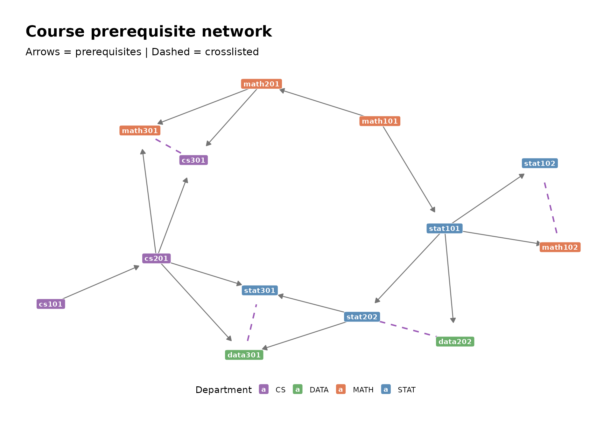

# Visual QA: every model type plotted

This article plots every model type supported by networkformat. Use it
as a visual sanity check — every node label, edge direction, and colour
mapping should look reasonable. For the raw output behind these plots,
see the [complete method
reference](https://jessebrandtdata.github.io/networkformat/articles/complete-method-reference.md).

## Decision tree (tree)

``` r

tr <- tree::tree(Species ~ Sepal.Length + Sepal.Width, data = iris)
tg <- as_tbl_graph(tr) %>%
  mutate(fill_var = ifelse(is_leaf, yval, var))

node_df <- as.data.frame(tg, what = "vertices")
vars    <- setdiff(unique(node_df$var), "<leaf>")
classes <- unique(node_df$yval[node_df$is_leaf])
pal <- c(
  setNames(c("#3B8EA5", "#D4A373"), vars[seq_len(min(length(vars), 2))]),
  setNames(c("#66c2a5", "#fc8d62", "#8da0cb"), classes[seq_len(min(length(classes), 3))])
)

ggraph(tg, layout = "tree") +
  geom_edge_diagonal(colour = "grey60", width = 0.5) +
  geom_edge_diagonal(
    aes(label = ifelse(is.na(split_point), "", paste0(split_op, split_point))),
    angle_calc = "along", label_dodge = unit(3, "mm"),
    label_size = 2.5, label_colour = "grey30", colour = NA) +
  geom_node_label(
    aes(label = label, fill = fill_var),
    size = 2.5, colour = "white", fontface = "bold",
    label.padding = unit(0.25, "lines"), label.r = unit(0.2, "lines")) +
  scale_fill_manual(values = pal, name = NULL) +
  theme_graph(base_family = "sans") +
  theme(legend.position = "bottom") +
  labs(title = "Decision tree (tree)",
       subtitle = "Nodes coloured by split variable / predicted class")
```


## Recursive partitioning (rpart)

``` r

rp <- rpart::rpart(Species ~ ., data = iris)
tg_rp <- as_tbl_graph(rp) %>%
  mutate(fill_var = ifelse(is_leaf, yval, var))

node_df <- as.data.frame(tg_rp, what = "vertices")
vars    <- setdiff(unique(node_df$var), "<leaf>")
classes <- unique(node_df$yval[node_df$is_leaf])
pal_rp <- c(
  setNames(c("#3B8EA5", "#D4A373", "#7B68AE", "#E07B54")[seq_along(vars)], vars),
  setNames(c("#66c2a5", "#fc8d62", "#8da0cb")[seq_along(classes)], classes)
)

ggraph(tg_rp, layout = "tree") +
  geom_edge_diagonal(colour = "grey60", width = 0.5) +
  geom_edge_diagonal(
    aes(label = ifelse(is.na(split_point), "", paste0(split_op, split_point))),
    angle_calc = "along", label_dodge = unit(3, "mm"),
    label_size = 2.5, label_colour = "grey30", colour = NA) +
  geom_node_label(
    aes(label = label, fill = fill_var),
    size = 2.5, colour = "white", fontface = "bold",
    label.padding = unit(0.25, "lines"), label.r = unit(0.2, "lines")) +
  scale_fill_manual(values = pal_rp, name = NULL) +
  theme_graph(base_family = "sans") +
  theme(legend.position = "bottom") +
  labs(title = "Recursive partitioning (rpart)",
       subtitle = "Note rpart uses >= operator convention (vs tree's >)")
```


## Random forest (randomForest)

All trees as disconnected components:

``` r

set.seed(12)
rf <- randomForest::randomForest(Species ~ ., data = iris, ntree = 3, maxnodes = 5)
tg_rf <- as_tbl_graph(rf) %>%
  mutate(fill_var = ifelse(is_leaf,
    ifelse(prediction == 0, NA_character_, rf$classes[prediction]),
    split_var_name))

node_df <- as.data.frame(tg_rf, what = "vertices")
pred_vars   <- sort(unique(na.omit(node_df$split_var_name)))
leaf_classes <- sort(unique(na.omit(node_df$fill_var[node_df$is_leaf])))
pal_rf <- c(
  setNames(c("#3B8EA5", "#D4A373", "#7B68AE", "#E07B54")[seq_along(pred_vars)], pred_vars),
  setNames(c("#66c2a5", "#fc8d62", "#8da0cb")[seq_along(leaf_classes)], leaf_classes)
)

ggraph(tg_rf, layout = "tree") +
  geom_edge_link(
    arrow = arrow(length = unit(1.5, "mm"), type = "closed"),
    end_cap = circle(5, "mm"), colour = "grey70", width = 0.3) +
  geom_node_label(
    aes(label = label, fill = fill_var),
    size = 2.5, colour = "black", fontface = "bold",
    label.padding = unit(0.2, "lines"), label.r = unit(0.15, "lines"),
    alpha = 0.85) +
  scale_fill_manual(values = pal_rf, name = NULL) +
  theme_graph(base_family = "sans") +
  theme(legend.position = "bottom") +
  labs(title = "Random forest — all 3 trees",
       subtitle = "Each disconnected component is one tree")
```


Single-tree closeup with dendrogram layout:

``` r

tg1 <- as_tbl_graph(rf, treenum = 1) %>%
  mutate(fill_var = ifelse(is_leaf,
    ifelse(prediction == 0, NA_character_, rf$classes[prediction]),
    split_var_name))

ggraph(tg1, layout = "dendrogram") +
  geom_edge_elbow(colour = "grey65", width = 0.4) +
  geom_node_label(
    aes(label = label, fill = fill_var),
    colour = "black", size = 2.5, fontface = "bold",
    label.padding = unit(0.25, "lines"), label.r = unit(0.2, "lines"),
    label.size = 0.4, alpha = 0.2) +
  geom_node_text(
    aes(label = label),
    colour = "black", size = 2.5, fontface = "bold") +
  scale_fill_manual(values = pal_rf, name = NULL) +
  theme_graph(base_family = "sans") +
  theme(legend.position = "bottom") +
  labs(title = "Random forest — tree 1 (dendrogram layout)")
#> Warning in geom_node_label(aes(label = label, fill = fill_var), colour =
#> "black", : Ignoring unknown parameters: `label.size`
```


## Gradient boosted model (gbm)

``` r

set.seed(12)
gb <- gbm::gbm(mpg ~ ., data = mtcars,
                distribution = "gaussian", n.trees = 3, interaction.depth = 3,
                n.minobsinnode = 3, bag.fraction = 0.8)

tg_gb <- as_tbl_graph(gb, treenum = 1) %>%
  mutate(fill_var = ifelse(is_leaf, prediction, NA_real_))

ggraph(tg_gb, layout = "tree") +
  geom_edge_diagonal(colour = "grey60", width = 0.5) +
  geom_node_label(
    aes(label = label, fill = fill_var),
    size = 2.5, fontface = "bold",
    label.padding = unit(0.25, "lines"), label.r = unit(0.2, "lines")) +
  scale_fill_gradient2(
    low = "#d73027", mid = "white", high = "#1a9850",
    midpoint = mean(mtcars$mpg),
    na.value = "#B0BEC5", name = "Predicted MPG") +
  theme_graph(base_family = "sans") +
  theme(legend.position = "bottom") +
  labs(title = "GBM — tree 1 (mtcars mpg)",
       subtitle = "Leaf colour encodes predicted MPG; grey = internal split nodes")
```


All trees as disconnected components:

``` r

tg_gb_all <- as_tbl_graph(gb) %>%
  mutate(fill_var = ifelse(is_leaf, prediction, NA_real_))

ggraph(tg_gb_all, layout = "tree") +
  geom_edge_diagonal(colour = "grey60", width = 0.5) +
  geom_node_label(
    aes(label = label, fill = fill_var),
    size = 2.5, fontface = "bold",
    label.padding = unit(0.2, "lines"), label.r = unit(0.15, "lines")) +
  scale_fill_gradient2(
    low = "#d73027", mid = "white", high = "#1a9850",
    midpoint = mean(mtcars$mpg),
    na.value = "#B0BEC5", name = "Predicted MPG") +
  theme_graph(base_family = "sans") +
  theme(legend.position = "bottom") +
  labs(title = "GBM — all 3 trees",
       subtitle = "Each disconnected component is one boosting iteration")
```


## XGBoost (xgb.Booster)

``` r

set.seed(12)
xg <- xgboost::xgboost(
  x = as.matrix(iris[, 1:4]),
  y = iris$Species,
  max_depth = 3, nrounds = 3, nthreads = 1
)

tg_xg <- as_tbl_graph(xg, treenum = 1) %>%
  mutate(fill_var = ifelse(is_leaf, quality, NA_real_))

ggraph(tg_xg, layout = "tree") +
  geom_edge_diagonal(colour = "grey60", width = 0.5) +
  geom_node_label(
    aes(label = label, fill = fill_var),
    size = 2.5, fontface = "bold",
    label.padding = unit(0.25, "lines"), label.r = unit(0.2, "lines")) +
  scale_fill_gradient2(
    low = "#d73027", mid = "white", high = "#1a9850", midpoint = 0,
    na.value = "#B0BEC5", name = "Quality") +
  theme_graph(base_family = "sans") +
  theme(legend.position = "bottom") +
  labs(title = "XGBoost — tree 1",
       subtitle = "String node IDs; leaf colour encodes quality score")
```


All trees as disconnected components:

``` r

tg_xg_all <- as_tbl_graph(xg) %>%
  mutate(fill_var = ifelse(is_leaf, quality, NA_real_))

ggraph(tg_xg_all, layout = "tree") +
  geom_edge_diagonal(colour = "grey60", width = 0.4) +
  geom_node_label(
    aes(label = label, fill = fill_var),
    size = 2, fontface = "bold",
    label.padding = unit(0.15, "lines"), label.r = unit(0.1, "lines")) +
  scale_fill_gradient2(
    low = "#d73027", mid = "white", high = "#1a9850", midpoint = 0,
    na.value = "#B0BEC5", name = "Quality") +
  theme_graph(base_family = "sans") +
  theme(legend.position = "bottom") +
  labs(title = "XGBoost — all 3 trees",
       subtitle = "Each disconnected component is one boosting round; string node IDs are globally unique")
```


## Course prerequisite network (data.frame)

``` r

data(courses)
all_edges <- edgelist(courses,
                      source_cols = c(prereq, prereq2, crosslist),
                      target_cols = course)
all_edges$directed <- all_edges$from_col != "crosslist"
all_edges <- all_edges[all_edges$directed | all_edges$from < all_edges$to, ]

nodes <- nodelist(courses, id_col = course)
g <- graph_from_data_frame(all_edges, vertices = nodes)
tg_courses <- as_tbl_graph(g)

dept_pal <- c(STAT = "#5B8DB8", MATH = "#E07B54", DATA = "#6BAF6B", CS = "#9B6BB0")

ggraph(tg_courses, layout = "stress") +
  geom_edge_link(
    aes(filter = directed),
    arrow = arrow(length = unit(2, "mm"), type = "closed"),
    end_cap = circle(8, "mm"), width = 0.5, colour = "grey45") +
  geom_edge_link(
    aes(filter = !directed),
    end_cap = circle(6, "mm"), start_cap = circle(6, "mm"),
    width = 0.8, colour = "#9B59B6", linetype = "dashed") +
  geom_node_label(
    aes(label = name, fill = dept),
    colour = "white", fontface = "bold", size = 3,
    label.padding = unit(0.3, "lines"), label.r = unit(0.2, "lines")) +
  scale_fill_manual(values = dept_pal, name = "Department") +
  theme_graph(base_family = "sans") +
  theme(legend.position = "bottom") +
  labs(title = "Course prerequisite network",
       subtitle = "Arrows = prerequisites | Dashed = crosslisted")
```



## List

``` r

x <- list(
  model = list(
    coefficients = 0.5,
    residuals = list(train = 0.1, test = 0.2)
  ),
  data = list(
    features = list(x1 = 1, x2 = 2, x3 = 3),
    target = "y"
  ),
  metadata = list(
    created = "2024-01-01",
    version = 1L
  )
)

el <- edgelist(x, name_root = "config")
nl <- nodelist(x, name_root = "config")
g <- graph_from_data_frame(el, directed = TRUE, vertices = nl)
tg_list <- as_tbl_graph(g)

type_pal <- c(list = "#3B8EA5", numeric = "#66c2a5",
              character = "#fc8d62", integer = "#8da0cb")

ggraph(tg_list, layout = "tree") +
  geom_edge_diagonal(colour = "grey60", width = 0.5) +
  geom_node_label(
    aes(label = label, fill = type),
    size = 2.5, colour = "white", fontface = "bold",
    label.padding = unit(0.25, "lines"), label.r = unit(0.2, "lines")) +
  scale_fill_manual(values = type_pal, name = "Type") +
  theme_graph(base_family = "sans") +
  theme(legend.position = "bottom") +
  labs(title = "List — recursive structure",
       subtitle = "Node colour encodes element type; labels show element names")
```


## Vector

``` r

v <- c("Intro", "Methods", "Analysis", "Results", "Discussion")
el <- edgelist(v)
nl <- nodelist(v)
g <- graph_from_data_frame(el, vertices = nl)
tg_v <- as_tbl_graph(g)

ggraph(tg_v, layout = "linear") +
  geom_edge_link(
    arrow = arrow(length = unit(2, "mm"), type = "closed"),
    end_cap = circle(10, "mm"), start_cap = circle(10, "mm"),
    colour = "grey50", width = 0.6) +
  geom_node_label(
    aes(label = name), fill = "#3B8EA5", colour = "white",
    fontface = "bold", size = 3.5,
    label.padding = unit(0.3, "lines"), label.r = unit(0.2, "lines")) +
  theme_graph(base_family = "sans") +
  labs(title = "Vector — sequential chain")
```


