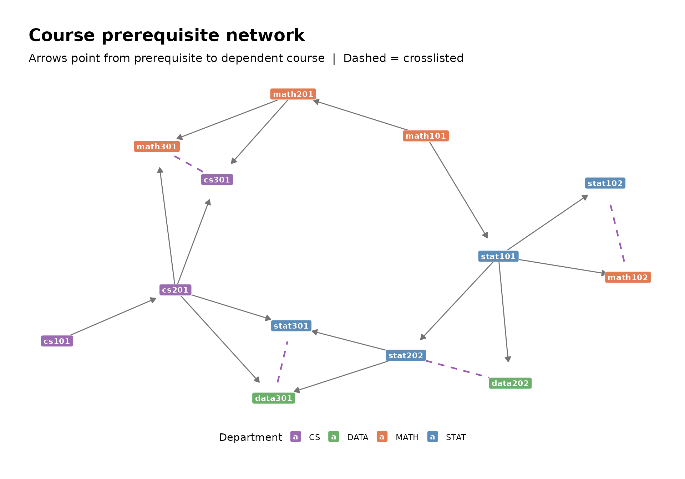

# Visualizing models as networks

``` r

library(networkformat)
library(ggraph)
library(tidygraph)
```

**networkformat** converts R objects into graph-ready format for
visualization with ggraph. For tree models, the quickest path is:

- `as.igraph(x)` — convert a model to an igraph object
- `as_tbl_graph(x)` — convert to a tidygraph tbl_graph (for use with
  ggraph)

For vectors and data frames, use
[`edgelist()`](https://jessebrandtdata.github.io/networkformat/reference/edgelist.md)
and
[`nodelist()`](https://jessebrandtdata.github.io/networkformat/reference/nodelist.md)
to build the edge/node data, then pass them to igraph or tidygraph. If
you want to work with the raw edgelists and nodelists directly —
filtering edges, computing graph statistics, or building custom igraph
objects — see
[`vignette("edgelist-nodelist")`](https://jessebrandtdata.github.io/networkformat/articles/edgelist-nodelist.md).

## Decision tree

``` r

tr <- tree::tree(Species ~ Sepal.Length + Sepal.Width, data = iris)
tg <- as_tbl_graph(tr)
```

The graph carries all the attributes you need for plotting — node
labels, split variables, leaf predictions, observation counts, and
parsed edge thresholds.

``` r

cat("Nodes:", igraph::vcount(tg), " Edges:", igraph::ecount(tg),
    " Depth:", max(igraph::distances(tg, mode = "out")[1, ]), "\n")
#> Nodes: 15  Edges: 14  Depth: 4
```

``` r

# Add a fill column: split variable for internal nodes, predicted class for leaves
tg <- tg %>%
  mutate(fill_var = ifelse(is_leaf, yval, var))

# Build a palette: one color per variable + one per class
node_df <- as.data.frame(tg, what = "vertices")
vars <- setdiff(unique(node_df$var), "<leaf>")
classes <- unique(node_df$yval[node_df$is_leaf])
var_pal <- c(
  setNames(c("#3B8EA5", "#D4A373"), vars[seq_len(min(length(vars), 2))]),
  setNames(c("#66c2a5", "#fc8d62", "#8da0cb"), classes[seq_len(min(length(classes), 3))])
)

ggraph(tg, layout = "tree") +
  geom_edge_diagonal(colour = "grey60", width = 0.5) +
  geom_edge_diagonal(
    aes(label = ifelse(is.na(split_point), "", paste0(split_op, split_point))),
    angle_calc = "along", label_dodge = unit(3, "mm"),
    label_size = 2.5, label_colour = "grey30", colour = NA) +
  geom_node_label(
    aes(label = label, fill = fill_var),
    size = 2.5, colour = "white", fontface = "bold",
    label.padding = unit(0.25, "lines"), label.r = unit(0.2, "lines")) +
  scale_fill_manual(values = var_pal, name = NULL) +
  theme_graph(base_family = "sans") +
  theme(legend.position = "bottom") +
  labs(title = "Iris classification tree",
       subtitle = "Split on Sepal.Length and Sepal.Width")
```


Internal nodes are colored by the split variable. Leaf nodes show the
predicted class. Edge labels show the split condition (e.g. `<5.45`).

## Random forest

`as_tbl_graph(rf)` combines all trees into a single graph with
disconnected components — one per tree. Each node carries a `treenum`
attribute so you can distinguish them.

``` r

rf <- randomForest::randomForest(Species ~ ., data = iris, ntree = 3, maxnodes = 5)

# All 3 trees in one graph
tg_rf <- as_tbl_graph(rf)
```

``` r

cat("Nodes:", igraph::vcount(tg_rf), " Edges:", igraph::ecount(tg_rf),
    " Components:", igraph::count_components(tg_rf), "\n")
#> Nodes: 27  Edges: 24  Components: 3
```

``` r

# Map integer prediction indices to class names
tg_rf <- tg_rf %>%
  mutate(
    pred_class = rf$classes[prediction],
    display_label = ifelse(
      is_leaf, pred_class,
      paste0(split_var_name, "\n< ", round(split_point, 1))
    ),
    fill_var = ifelse(is_leaf, pred_class, split_var_name)
  )

# Palette: one color per predictor variable + one per predicted class
node_df <- as.data.frame(tg_rf, what = "vertices")
predictor_vars <- sort(unique(na.omit(node_df$split_var_name)))
leaf_classes <- sort(unique(na.omit(node_df$pred_class)))
var_colors <- c("#3B8EA5", "#D4A373", "#7B68AE", "#E07B54")
class_colors <- c("#66c2a5", "#fc8d62", "#8da0cb")
var_pal_rf <- c(
  setNames(var_colors[seq_along(predictor_vars)], predictor_vars),
  setNames(class_colors[seq_along(leaf_classes)], leaf_classes)
)

ggraph(tg_rf, layout = "tree") +
  geom_edge_link(
    arrow = arrow(length = unit(1.5, "mm"), type = "closed"),
    end_cap = circle(5, "mm"),
    colour = "grey70", width = 0.3) +
  geom_node_label(
    aes(label = display_label, fill = fill_var),
    size = 2.5, colour = "black", fontface = "bold",
    label.padding = unit(0.2, "lines"), label.r = unit(0.15, "lines"),
    alpha = 0.85) +
  scale_fill_manual(values = var_pal_rf, name = NULL) +
  theme_graph(base_family = "sans") +
  theme(legend.position = "bottom") +
  labs(title = "Random forest (3 trees)",
       subtitle = "Each disconnected component is one tree")
```


All three trees are visible in a single plot. Internal nodes are colored
by split variable; leaf nodes are colored by predicted class.

### Single tree from a forest

For a closer look at one tree:

``` r

tg1 <- as_tbl_graph(rf, treenum = 1) %>%
  mutate(
    pred_class = rf$classes[prediction],
    display_label = ifelse(
      is_leaf, pred_class,
      paste0(split_var_name, "\n< ", round(split_point, 1))
    ),
    fill_var = ifelse(is_leaf, pred_class, split_var_name)
  )

ggraph(tg1, layout = "dendrogram") +
  geom_edge_elbow(colour = "grey65", width = 0.4) +
  geom_node_label(
    aes(label = display_label, fill = fill_var),
    colour = "black", size = 2.5, fontface = "bold",
    label.padding = unit(0.25, "lines"), label.r = unit(0.2, "lines"),
    label.size = 0.4, alpha = 0.2) +
  geom_node_text(
    aes(label = display_label),
    colour = "black", size = 2.5, fontface = "bold") +
  scale_fill_manual(values = var_pal_rf, name = NULL) +
  theme_graph(base_family = "sans") +
  theme(legend.position = "bottom") +
  labs(title = "Tree 1 from the random forest")
#> Warning in geom_node_label(aes(label = display_label, fill = fill_var), :
#> Ignoring unknown parameters: `label.size`
```


## Course prerequisite network

networkformat also handles tabular data. The bundled `courses` dataset
contains 13 courses across 4 departments, with prerequisite and
crosslist relationships.

``` r

library(igraph)

# Prereqs as source so arrows naturally point prereq -> course;
# crosslist is undirected, so its direction doesn't matter
all_edges <- edgelist(courses,
                      source_cols = c(prereq, prereq2, crosslist),
                      target_cols = course)
all_edges$directed <- all_edges$from_col != "crosslist"
all_edges <- all_edges[all_edges$directed | all_edges$from < all_edges$to, ]

nodes <- nodelist(courses, id_col = course)
g <- graph_from_data_frame(all_edges, vertices = nodes)
tg_courses <- as_tbl_graph(g)

cat("Nodes:", vcount(g), " Edges:", ecount(g), "\n")
#> Nodes: 13  Edges: 19

dept_pal <- c(STAT = "#5B8DB8", MATH = "#E07B54", DATA = "#6BAF6B", CS = "#9B6BB0")

ggraph(tg_courses, layout = "stress") +
  geom_edge_link(
    aes(filter = directed),
    arrow = arrow(length = unit(2, "mm"), type = "closed"),
    end_cap = circle(8, "mm"),
    width = 0.5, colour = "grey45") +
  geom_edge_link(
    aes(filter = !directed),
    end_cap = circle(6, "mm"), start_cap = circle(6, "mm"),
    width = 0.8, colour = "#9B59B6", linetype = "dashed") +
  geom_node_label(
    aes(label = name, fill = dept),
    colour = "white", fontface = "bold", size = 3,
    label.padding = unit(0.3, "lines"), label.r = unit(0.2, "lines")) +
  scale_fill_manual(values = dept_pal, name = "Department") +
  theme_graph(base_family = "sans") +
  theme(legend.position = "bottom") +
  labs(title = "Course prerequisite network",
       subtitle = "Arrows point from prerequisite to dependent course  |  Dashed = crosslisted")
```



For the full data frame workflow — column selection, `na.rm`,
`attr_cols`, `symmetric_cols`, and graph statistics — see
[`vignette("edgelist-nodelist")`](https://jessebrandtdata.github.io/networkformat/articles/edgelist-nodelist.md).
